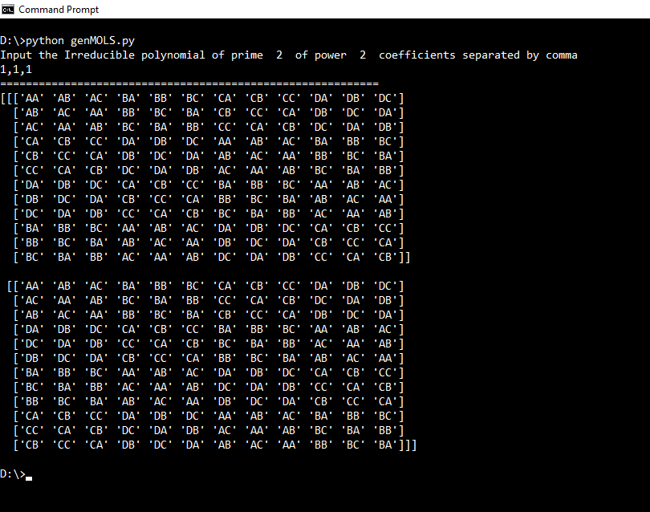

```{r setup, include=FALSE}
knitr::opts_chunk$set(echo = TRUE, comment = "", cache = F)
```

```{r echo = FALSE}
library(knitr)
library(reticulate)
```

# Question 1

**Four different designs for a digital circuit are being studied to the amount of noise present.** The following data have been obtained and read into memory.

```{r}
noise <- c(19, 20, 19, 30, 8, 
           80, 61, 73, 56, 80,
           47, 26, 25, 35, 50,
           95, 46, 83, 78, 97)
circuit <- rep(1:4, each = 5)
circuitdata <- data.frame(circuit = factor(circuit), noise = noise)
kable(head(circuitdata))
```

**(a) Is the amount of noise present the same for all four designs? Use $\alpha$ = 0.05.**

Firstly, a simple one-way ANOVA model is applied.

```{r}
fit <- lm(noise ~ circuit, data = circuitdata)
anova(fit)
```

We find that, the sum of squares explained by the treatment factor (i.e. the circuit design) is 12042 with 3 degrees of freedom. This gives us corresponding F statistic (for testing the hypothesis whether treatment effects are all equal) as 21.78 with p-value $6.797\times10^{-6}$ which is much less than the level of significance 0.05. Hence, we reject the null hypothesis and conclude that based on the given data, there is sufficient evidence to suspect that the noise level for all four designs are not same.

**(b) Analyze the residuals from this experiment. Are the analysis of variance assumptions satisfied?**

Consider the residual plot below. It shows the distribution of the standardized residuals against different treatments. Under the usual assumption that the errors in the model are independent and identically distributed with mean 0 and constant variance $\sigma^2$, the residual plot should show similar amount of spread from the x-axis for each treatment levels.

```{r}
mse <- 184.3   # this is an unbiased estimator of sigma^2
res <- fit$residuals/sqrt(mse)   # obtain the standardized residuals 
plot(circuit, res)
abline(h = 0)
```

We find that the spread is much larger for circuit desgin 4. The reason is possibly due to the outlier observation of noise level 47 presented for circuit design 4.

```{r}
qqnorm(res)
abline(a = 0, b = 1, col = "green")  # the reference line
```

Also, note that the normal QQplot (plotting theoretical quantiles from normal distribution against the sample quantiles from standardized residuals), exhibits strong evidence that the normality assumption for the residuals are not satisfied. There is a clear pattern of the series of points lying above the reference line.

Therefore, in essence, we might say that due to the presence of the outlier, the analysis of variance assumptions are not satisfied.


**(c) Which circuit design would you select for use? Low noise is best.**

Firstly, let us look at the noise levels for different circuit designs.

```{r}
boxplot(noise ~ circuit, data = circuitdata, 
        main = "Boxplot of Circuit Data", 
        xlab = "Circuit Design", ylab = "Noise Level")
```

Note that, the observations corresponding to the first circuit design lies systematically below the noise level observations of other designs. In comparison of numerical terms, we obtain the following result.

```{r}
summary(fit)
```

We obtain that considering circuit design 1 as the base level, the gain in noise level for all other circuit design (note the Estimate) is positive, which shows that the mean noise level is smallest for circuit design 1.

Therefore, we conclude that using Circuit design 1 is "best" with the evidence from the given data as low noise is preferred.


# Question 2

**An industrial engineer is investigating the effect of four assembly methods (A,B,C,D) on the assembly time for a color television component. Four operators are selected for the study. Furthermore, the engineer knows that each assembly method produces such fatigue that the time required for the last assembly may be greater than the time required for the first, regardless of the method. That is, a trend develops in the required assembly time. To account for this source of variability, the engineer uses the Latin square design. Analyze the data from this experiment (use $\alpha$ = 0.05) and draw appropriate conclusions.**

The data is read into memory by the following code.

```{r}
time <- c(10, 14, 7, 8, 7, 18, 11, 8, 5, 10, 11, 9, 10, 10, 12, 14)
order <- factor(rep(1:4, each = 4))
operator <- factor(rep(1:4, 4))
method <- factor(c("C", "D", "A", "B", "B", "C", "D", "A",
                   "A", "B", "C", "D", "D", "A", "B", "C"))
Assemblydata <- data.frame(time = time, order = order, operator = operator, method = method)
kable(Assemblydata)
```

Now, we perform a 3-way ANOVA model, in order to see the decomposition of total sum of squares in the sum of sqaures due to different factor effects.

```{r}
fit <- lm(time ~ order + operator + method, data = Assemblydata)
anova(fit)
```

From the above table, we see that the Assembly method explains a sum of sqaures of 72.5 with 3 degrees of freedom. The corresponding F-statistic for testing the hypothesis that the effect of assembly methods are same is given by 13.8095 with the corresponding p-value 0.004213 which is less than the given level of significance 0.05. Hence, based on the above data, we have sufficient evidence to reject the null hypothesis and conclude that the Assembly methods have significant effect on the assembly time.

In a very similar manner, we also note that the blocking factor Operator has also significant effect on the assembly time at the given level of significance.

However, for blocking factor Order of Assembly, the corresponding p-value is 0.088519, which is greater than 0.05, the given level of significance. Hence, the data does not show any sufficient evidence that the Order of Assmebly affects the Assembly time, as opposed to the suspicion of the engineer desgining the study.

Now, to check whether the basic assumptions of the ANOVA is satisfied (i.e. the errors are independent and identically distributed according to normal distribution with mean 0 and constant variance), we consider the following:

```{r}
mse <- 1.75   # this is an unbiased estimator of sigma^2
res <- fit$residuals/sqrt(mse)   # obtain the standardized residuals 
plot(as.numeric(method), res, pch = 19, xaxt = "n", 
     ylab = "Standardized Residuals", xlab = "Assembly Method")
axis(1, at = unique(as.numeric(method)), labels = levels(method))
abline(h = 0)
```

We find that, there is no evident outlier which lies extremely above or below than the x-axis.

To check whether there is any pattern in the data based on the order of the experiment, we consider the following residual plot.

```{r}
plot(as.numeric(order), res, pch = 19, ylab = "Standardized Residuals", xlab = "Assembly Order")
abline(h = 0, col = "blue")
```

We note that, there is slight pattern of heteroscadasticity in the data, as the time (or the order of the assembly progresses). This shows an indication of violoation of the assumption of ANOVA.

Finally, we obtain a QQplot for comparing the distribution of the standardized residuals with the theoretical normal distribution.

```{r}
qqnorm(res, xlim = c(-2, 2), ylim = c(-2, 2))
abline(a = 0, b = 1, col = "green")  # the reference line
```

Here, from the above plot, we find that the distribution of the standardized residuals may not be normal. Also note that, large dispersion of points on both sides of the reference line shows an indication of heteroscadasticity as mentioned earlier.


# Question 3

**A chemist wishes to test the effect of four chemical agents on the strength of a particular type of cloth. Because there might be variability from one bolt to another, the chemist decides to use randomized block design, with the bolts of cloth considered as blocks. She selects five bolts and applies all four chemicals in random order to each bolt. The resulting tensile strengths are provided** and read into memory.

```{r}
strength <- c(73, 68, 74, 71, 67, 
              73, 67, 75, 72, 70,
              75, 68, 78, 73, 68,
              75, 71, 75, 75, 69)
chemical <- rep(1:4, each = 5)
bolt <- factor(rep(1:5, 4))
Tensiledata <- data.frame(Tensile = strength, Chemical = factor(chemical), Bolt = bolt)
kable(head(Tensiledata))
```

Here, we use a 2-way ANOVA model in order to assess the effect of the chemical agents on the strength of the particular type of tensile. 

```{r}
fit <- lm(Tensile ~ Bolt + Chemical, data = Tensiledata)
anova(fit)
```

From the ANOVA table above, we find that the effect of the Chemical agents on the variation of the strength of the tensile explains a sum of sqaures of 16.95 with 3 degrees of freedom. This gives rise to an F-statistic value of 3.6064 with corresponding p-value 0.04589. Note that, this p-value is less than the usual level of significance ($\alpha = 0.05$), hence we reject the null hypothesis that there is no effect of Chemical agents on the strength of the tensiles. We conclude that the data shows sufficient evidence that the chemical agents has a significant effect on the tensile strength.

Also note that, in a similar way, we find that Bolts of cloth also has an significant effect on the tensile strength. 

To check the basic assumptions of the ANOVA model, we obtain;

```{r}
mse <- 1.567   # this is an unbiased estimator of sigma^2
res <- fit$residuals/sqrt(mse)   # obtain the standardized residuals 
plot(chemical, res, ylab = "Standardized Residuals", xlab = "Chemical")
abline(h = 0, col = "blue")
```

Note that, in the effect of the level 2 of the chemical, 4 of the residuals lie below x-axis while the value of another residual lies far above x-axis. This shows a possible evidence of an outlier.

```{r}
plot(as.numeric(bolt), res, ylab = "Standardized Residuals", xlab = "Bolt")
abline(h = 0, col = "blue")
```

In a similar way, the outlier is seen at the level 5 of the bolt effect above.

Finally, we perform a QQplot to check whether the normality assumptions of the standardized residuals are being violated.

```{r}
qqnorm(res, xlim = c(-2, 2), ylim = c(-2, 2))
abline(a = 0, b = 1, col = "green")  # the reference line
```

Clearly, the above qqplot shows a clear quadratic pattern of point lying systematically below the reference line, exhibiting a "possible" indication of the violation of normality assumption.

# Question 4

**Suppose that in Problem 3, the observations for chemical type 2 and bolt 3 and chemical type 4 and bolt 4 are missing.**

**(a) Analyze the design by iteratively estimating the missing values.**

Firstly, we set the observations for chemical type 2 and bolt 3 and chemical type 4 and bolt 4 which are missing to be NA values.

```{r}
Tensiledata[8, 1] <- NA
Tensiledata[19, 1] <- NA
```

To iteratively estimate the missing values, we use Expectation - Maximization Algorithm. It would consist of two parts,

- Expectation part computes the expected (i.e. the predicted values) of the missing observations from the last fitted model, and replaces them.

- Maximization part finds the maximum likelihood estimator conditioned on the expected values filled at the place of missing values. Under the assumption of normality of errors, this step corresponds to fitting a linear model with the missing values as replaced by expectation step, as we minimize the residual sum of sqaures.

This two procedure are repeated until convergence. We start with an initial value of 71.85 (which is the mean of the existing observations), placed at the missing values.

Let $\theta^{(t)}$ denote the estimated parameter vector at $t$-th iteration and let $\theta_i^{(t)}$ denotes its $i$-th coordinate, then the convergence criteria chosen here is that, 

$$\sum_i \dfrac{|\theta_i^{(t)} - - \theta_i^{(t-1)}|}{| \theta_i^{(t-1)}|} < \epsilon$$
for some suitably choosen threshold parameter $\epsilon > 0$.

```{r}
EMdata <- Tensiledata
EMdata[c(8, 19), 1] <- 71.85

temp <- data.frame(Chemical = factor(c(2,4)), Bolt = factor(c(3,4)))  # used for expectation

EM <- function(data, preddata, thres) {
    new_params <- rep(1, 8)   # this is theta^(0)
    error <- 10
    while (error > thres) {
        cur_params <- new_params
        fit <- lm(Tensile ~ Chemical + Bolt, data = data)
        new_params <- fit$coefficients
        y <- predict(fit, newdata = preddata)
        data[c(8, 19), 1] <- y
        error <- sum(abs((new_params - cur_params)/cur_params))
    }
    return(fit)
}

fit <- EM(EMdata, preddata = temp, thres = 10^(-6))

anova(fit)
```

We note that, under the missing value setup, EM algorithm converges to the parameters, which yields a linear fitted model with residual sum of sqaures to be 16.75 on 12 degrees of freedom. Also note that, from the ANOVA table of the fitted model, it is seemed that Chemical agent does not have a significant effect at a $\alpha = 0.05$ significance level as the corresponding F-statistic yields a p-value of 0.06654 which is more than $\alpha$.

We can also obtain the value at which the missing observations converge.

```{r}
fit$model[c(8,19),]
```


**(b) Differentiate SSE with respect to the two missing values, equate the result to zero, and solve for estimates of the missing values. Analyze the design using these two estimates of the missing values.**

Note that, before proceeding with this approach, we first write down the mathematical formula of the linear model of the above experiment,
$$y_{ij} = \mu + \tau_i + \beta_j + \epsilon_{ij}$$
where;

- $y_{ij}$ denotes the observation of tensile strength corresponding to $i$-th level of chemical and $j$-th level of bolt. Here, $i=1,2,3,4$ and $j = 1,2,\dots,5$.

- $\mu$ is the average tensile strength.

- $\tau_i$ is the effect of $i$-th chemical level.

- $\beta_j$ is the effect of $j$-th level of bolt.

- $\epsilon_{ij}$ are independent and normally distributed errors with mean 0 and constant variance.

However, in the missing value problem, we are missing the observation $y_{23}$ and $y_{44}$. Let us denote the imputed value at those missing observations are $w_1$ and $w_2$ respectively. We also know that, under Randomized Block Design without any missing values, the error sum of squares is given by;

$$SSE = \sum_{ij}y_{ij}^2 - \sum_i \dfrac{T_i^2}{5} - \sum_j \dfrac{B_j^2}{4} + \dfrac{G^2}{20}$$

where $T_i$'s are row totals and $B_j$'s are column totals (according to the table given in question 3), and $G$ is the grand total. 

Now, for this particular problem, we compute the row totals and column totals accordingly,
 

```{r}
tapply(Tensiledata$Tensile, Tensiledata$Chemical, sum, na.rm = T) # for T_i
tapply(Tensiledata$Tensile, Tensiledata$Bolt, sum, na.rm = T) # for B_j
sum(Tensiledata$Tensile^2, na.rm = T)   # for y_{ij}^2
sum(Tensiledata$Tensile, na.rm = T)     # for G
```

From the above calculation, it follows that;

$$\begin{aligned}
SSE & = (92199 + w_1^2 + w_2^2) - \dfrac{353^2 + (282+w_1)^2 + 362^2 + (290 + w_2)^2}{5}\\
& - \dfrac{296^2 +274^2 + (227+w_1)^2 + (216 + w_2)^2 + 274^2}{4} + \dfrac{(1287 + w_1 + w_2)^2}{20}
\end{aligned}$$

Differentiating above expression with respect to $w_1$ and $w_2$ and setting it to 0 yields,

$$\dfrac{\partial SSE}{\partial w_1} = 2w_1 - 2\dfrac{282 + w_1}{5} - 2\dfrac{227 + w_1}{4} + 2\dfrac{1287 + w_1 + w_2}{20} = 0$$

and 

$$\dfrac{\partial SSE}{\partial w_2} = 2w_2 - 2\dfrac{290 + w_2}{5} - 2\dfrac{216 + w_2}{4} + 2\dfrac{1287 + w_1 + w_2}{20} = 0$$

These equations reduces to; 

$$12w_1 + w2 = 976; \qquad w_1 + 12w_2 = 953$$

Solving these, we obtain;

```{r}
solve(matrix(c(12,1,1,12), nrow = 2), c(976, 953))
```

Note that, these two estimates of missing values are exactly same as the estimates obtained from the EM algorithm. Therefore, the fitted linear model will remain same as before. 


**(c) Derive general formulas for estimating two missing values when the observations are in different blocks.**

The general case of Randomized Block design can be modelled using the following linear model;
$$y_{ij} = \mu + \tau_i + \beta_j + \epsilon_{ij}; \quad i = 1,\dots v; j = 1,\dots b$$

When all observations are known, the SSE is given by;

$$ SSE = \sum_{ij}y_{ij}^2 - \sum_i \dfrac{T_i^2}{b} - \sum_j \dfrac{B_j^2}{v} + \dfrac{G^2}{bv}$$

where notations are as usual. 

When the missing values are in different blocks, there are two subcases which can happen. The missing observations both can come from same treatment effect, or from different treatment effect. Let $w_1$ and $w_2$ be the missing observations, coming from blocks $j_1$ and $j_2$ respectively and treatment $i_1$ and $i_2$ respectively.

*Subcase: $i_1 \neq i_2$*

Differentiating SSE with respect to $w_1$ and setting it to 0 yields,

$$w_1 - \dfrac{T_{i_1,e} + w_1}{b} - \dfrac{B_{j_1,e} + w_1}{v} + \dfrac{G_e + w_1 + w_2}{bv} = 0$$
i.e.
$$(b-1)(v-1)w_1 + w_2 = vT_{i_1,e} + bT_{j_1,e} - G_e$$

where subscript $e$, denotes the existing observations only. Similarly, we obtain;
$$w_1 + (b-1)(v-1)w_2 = vT_{i_2,e} + bT_{j_2,e} - G_e$$

Therefore, solving them, we obtain;

$$\hat{w}_1 = \dfrac{v( (b-1)(v-1)T_{i_1,e} - T_{i_2,e} ) + b( (b-1)(v-1)B_{j_1,e} - B_{j_2,e} ) - (bv - b - v)G_e}{(b-1)^2(v-1)^2 - 1}$$

and 

$$\hat{w}_2 = \dfrac{v( (b-1)(v-1)T_{i_2,e} - T_{i_1,e} ) + b( (b-1)(v-1)B_{j_2,e} - B_{j_1,e} ) - (bv - b - v)G_e}{(b-1)^2(v-1)^2 - 1}$$

*Subcase $i_1 = i_2 = i_0$ (say)*

Differentiating SSE with respect to $w_1$ and setting it to 0 yields,

$$w_1 - \dfrac{T_{i_0,e} + w_1 + w_2}{b} - \dfrac{B_{j_1,e} + w_1}{v} + \dfrac{G_e + w_1 + w_2}{bv} = 0$$
i.e.
$$(b-1)(v-1)w_1 - (v-1)w_2 = vT_{i_0,e} + bB_{j_1,e} - G_e$$

Similarly, differentiating with respect to $w_2$ and setting it to 0 yields,
$$-(v-1)w_1 + (b-1)(v-1)w_2 = vT_{i_0,e} + bB_{j_2,e} - G_e$$

Solving these two equations, we obtain;

$$\hat{w}_1 = \dfrac{bvT_{i_0, e} + b( (b-1)B_{j_1, e} + B_{j_2,e} ) - bG_e}{b(b-2)(v-1)}$$
and 
$$\hat{w}_2 = \dfrac{bvT_{i_0, e} + b( (b-1)B_{j_2, e} + B_{j_1,e} ) - bG_e}{b(b-2)(v-1)}$$


**(d)  Derive general formulas for estimating two missing values when the observations are in same blocks.**


Note that, since the observations are in the same block, hence they must come from different levels of treatments, otherwise there would not remain two missing values.

Therefore, in this scenario, we assume that the missing values are $w_1$ and $w_2$ which comes from $i_1$ and $i_2$ level of treatment factor and $j_0$ level of blocking factor.

Similar to before, differentiating SSE with respect to $w_1$ and setting it to 0 yields,

$$w_1 - \dfrac{T_{i_1,e} + w_1}{b} - \dfrac{B_{j_0,e} + w_1 + w_2}{v} + \dfrac{G_e + w_1 + w_2}{bv} = 0$$
i.e.
$$(b-1)(v-1)w_1 - (b-1)w_2 = vT_{i_1,e} + bB_{j_0,e} - G_e$$

Similarly, differentiating with respect to $w_2$ and setting it to 0 yields,
$$-(b-1)w_1 + (b-1)(v-1)w_2 = vT_{i_2,e} + bB_{j_0,e} - G_e$$

Solving these two equations, we obtain;

$$\hat{w}_1 = \dfrac{v( (v-1)T_{i_1, e} + T_{i_2,e} ) + bvB_{j_0, e} - vG_e}{v(b-1)(v-2)}$$
and 
$$\hat{w}_2 = \dfrac{v( T_{i_1, e} + (v-1)T_{i_2,e} ) + bvB_{j_0, e} - vG_e}{v(b-1)(v-2)}$$


# Question 5

**Three brands of batteries are under study. It is suspected that the lives (in weeks) of the three brands are different. Five batteries of each brand are tested with the given results:** The results are loaded into the memory of R for analyzing.

```{r}
life <- c(100, 96, 92, 96, 92, 
          76, 80, 75, 84, 82,
          108, 100, 96, 98, 100)
brands <- rep(1:3, each = 5)
Batterydata <- data.frame(Life = life, Brands = factor(brands))
kable(Batterydata)
```


**(a) Are the lives of these brands of batteries different?**

To check whether the lives of these brands of batteries are different, we need to form a hypothesis testing framework. Consider the usual null hypothesis that the effect of different brands of batteries are same on the live of the batteries. To test this hypothesis, we construct the ANOVA table as follows;

```{r}
fit <- lm(Life ~ Brands, data = Batterydata)
anova(fit)
```

Note that, from the above ANOVA table, the sum of square explained by the effect of different brands is 1196.1, giving rise to the corresponding F-statistic for testing the above mentioned hypothesis as 38.338 and with an p-value of $6.141\times10^{-6}$ which is much less than the usual level of significance $\alpha = 0.05$. Therefore, on the evidence based on the sample obtained above, we reject the null hypothesis and conclude that the data shows sufficient evidence to suspect that the lives of the different brands of batteries are generally different.

**(b) Analyze the residuals from this experiment and comment on the model's adequacy.**

To check the adequacy of the ANOVA model based on the residuals, we consider the residual plot as shown.

```{r}
mse <- 15.6   # this is an unbiased estimator of sigma^2
res <- fit$residuals/sqrt(mse)   # obtain the standardized residuals 
plot(brands, res, ylab = "Standardized Residuals", xlab = "Brands of Batteries")
abline(h = 0, col = "blue")
```

We find that there is an evident outlier in level 3 of the brand, as there are 4 observations whose residuals lie below x-axis and only 1 observation having residual far above the x-axis. From the data itself, we see that the life of the 1st battery of brand 3 has a life of 108 weeks, which is much higher compared to other batteries of same brand.

To check the normality assumptions of the standardized residuals, we consider the QQplot as shown below.

```{r}
qqnorm(res, xlim = c(-2, 2), ylim = c(-2, 2))
abline(a = 0, b = 1, col = "green")  # the reference line
```

Note that, other than one outlier observation, the rest of the standardized residuals lie close to the reference line. This implies, other than the outlier, the normality assumption is "seemed" to be satisfied.

**(c) Construct a 95% confidence interval estimate on the mean life of battery brand 2. Construct a 99% confidence interval estimate on the mean difference between the lives of battery brands 2 and 3.**

To construct a 95% confidence interval estimate on the mean life of battery brand 2, we consider the underlying mathematical model;

$$y_{ij} = \mu + \tau_i+\epsilon_{ij}$$
where $\mu$ is the overall average effect, $\tau_i$ is the specific effect of the $i$-th brand and $\epsilon_{ij}$'s are the errors.

Now, in this particular case, $\psi = \mu + \tau_2$ is estimable and let us assume its BLUE is denoted by $\hat{\psi}$. Then, 

$$\hat{\psi} \sim N(\psi, \frac{\sigma^2}{5})$$

as there are 5 replications of each brand of batteries. Therefore, we also have,

$$\dfrac{\sqrt{5}(\hat{\psi} - \psi)}{\sqrt{MSE}} \sim t_{12}$$
where $t_n$ denotes the student's t distribution with $n$ degrees of freedom. Also, here $MSE$ denotes the Mean Sum of squares due to error.

From this, we obtain the 95% confidence interval of $\psi$ as $(\hat{\psi} - \sqrt{\dfrac{MSE}{5}}t_{12,0.025}, \hat{\psi} + \sqrt{\dfrac{MSE}{5}}t_{12,0.025})$ where $t_{12,0.025}$ denotes the upper 0.025 quantile of the Student's t distribution with 12 degrees of freedom.

```{r}
summary(fit)
```

From the above table, we see that $\hat{\psi} = (95.2 - 15.8) = 79.4$. Also, from the ANOVA table as shown before, we obtain that $MSE = 15.6$. Hence, the 95% confidence interval for mean life of battery of brand 2 is given by;

```{r}
conf.upper <- 79.4 + sqrt(15.6/5) * qt(0.025, df = 12, lower.tail = F)
conf.lower <- 79.4 + sqrt(15.6/5) * qt(0.025, df = 12)
print(paste('The 95% Confidence Interval is', conf.lower,'to', conf.upper))
```


For the 2nd part of the question, i.e. to obtain the 99% confidence interval  estimate on the mean difference between the lives of battery brands 2 and 3.

Note that, in a similar way as before, we have,

$$\hat{\tau}_2 - \hat{\tau}_3 \sim N(\tau_2 - \tau_3, \frac{2\sigma^2}{5})$$
where $\hat{\tau}_i$ is the BLUE of $\tau_i$, i.e. the mean effect on the lives of batteries of $i$-th brand.

Therefore, similar to before, we have the 99% confidence interval for the mean difference between the lives of battery of brand 2 and 3 given by; $(\hat{\tau_2} - \hat{\tau_3} - \sqrt{\dfrac{2\times MSE}{5}}t_{12,0.005}, \hat{\tau_2} - \hat{\tau_3} + \sqrt{2\times \dfrac{MSE}{5}}t_{12,0.005})$ where $t_{12,0.005}$ denotes the upper 0.005 quantile of the Student's t distribution with 12 degrees of freedom.


Now, note that the BLUE of $\tau_2 - \tau_1$ is -15.800, while the BLUE of $\tau_3 - \tau_1$ is 5.200 as seen from the previous table. Hence, the BLUE of the contrast $\tau_2 - \tau_3$ is $(-15.8)-5.2 = (-21)$. Finally, we have the 99% confidence interval is given as;


```{r}
conf.upper <- (-21) + sqrt(2*15.6/5) * qt(0.005, df = 12, lower.tail = F)
conf.lower <- (-21) + sqrt(2*15.6/5) * qt(0.005, df = 12)
print(paste('The 99% Confidence Interval is', conf.lower,'to', conf.upper))
```


# Question 6

**The effect of five different ingredients (A,B,C,D,E) on the reaction time of a chemical process is being studied. Each batch of new material is only large enough to permit five runs to be made. Furthermore, each run requires approximately $1\frac{1}{2}$ hours, so only five runs can be made in one day. The experiment decides to run the experiment as a Latin square so that day and batch effects may be systematically controlled. She obtains the data that follows.**

```{r}
rectime <- c(8, 7, 1, 7, 3,
          11, 2, 7, 3, 8,
          4, 9, 10, 1, 5,
          6, 8, 6, 6, 10,
          4, 2, 3, 8, 8)
batch <- rep(1:5, each = 5)
day <- rep(1:5, 5)
ingredients <- c("A","B","D","C","E",
                 "C","E","A","D","B",
                 "B","A","C","E","D",
                 "D","C","E","B","A",
                 "E","D","B","A","C")
Chemdata <- data.frame(Time = rectime, Batch = factor(batch), 
                       Day = factor(day), Ingr = factor(ingredients))
kable(head(Chemdata, 10))
```

Firstly, we perform a 3-way ANOVA model to obtain the division of the total sum of squares into the sum of squares due to specific treatment or blocking effects.

```{r}
fit <- lm(Time ~ Batch + Day + Ingr, data = Chemdata)
anova(fit)
```

From the ANOVA table as shown above, we note that the effect of the Chemical Ingredients yields a sum of sqaures of 141.55 under 4 degrees of freedom, thus giving rise to a value of the F-statistic as 11.3092. Using this F-statistic to test the null hypothesis that the effect of all of the Chemical Ingredients are same, we obtain a p-value of 0.0004877, which is much lower than the usual level of significance $\alpha = 0.05$, hence, we reject the null hypothesis and conclude that the data shows sufficient evidence to suspect that the Chemical Ingredients pose a significant effect on the reaction time.

In a similar way, the higher p-values for both the Batch and Day (the Blocking) effects show that the data does not provide sufficient evidence that chemical reaction is affected by the Batch number or the Day on which the observation was made.

Note that, we should now consider the standardized residuals to check whether the basic assumptions of ANOVA model is being violated or not. For that, we consider various residual plots.

```{r}
res <- fit$residuals
res <- res/sqrt(3.127)  # since the MSE is 3.127
plot(as.numeric(Chemdata$Ingr), res, xaxt = "n", ylab = "Standardized Residuals", xlab = "Ingredients")
axis(1, at = unique(as.numeric(Chemdata$Ingr)), labels = levels(Chemdata$Ingr))
abline(h = 0, col = "blue")
```

We see that the variablity of the standardized residuals are same for all levels of Ingredients. There is no evident outlier present in the data.

```{r}
plot(batch, res, xlab = "Batch", ylab = "Standardized Residuals")
abline(h = 0, col = "blue")
plot(day, res, xlab = "Day", ylab = "Standardized Residuals")
abline(h = 0, col = "blue")
```

Also from the plots shown above, we note that increasing the level of blocking factor, i.e. with different batches on different days, the standardized residuals does not exihibit a pattern of heterogeoenous variablity, hence we can say that the ANOVA assumptions of constant error variance seems to be satisfied.

To check whether the independence of the residuals is preserved, we plot the residuals against their order of observation, assuming Batch 1 of day 1 is observed first, then Batch 2 of day 1 and so on.

```{r}
plot(batch + day*5 - 5, res, xlab = "Order of Observation", ylab = "Standardized Residuals")
abline(h = 0, col = "blue")
```

From the plot above, we find that there is no evident pattern between the residuals, as they are randomly distributed evenly on both sides of the x-axis. Hence, this residual plot does not show any evidence on non-linear dependence between the residuals, assuring that the assumption of independence to be satisfied to some extent.

Finally, to check whether the residuals does follow a normal distribution, we consider the QQplot of the standardized residuals.

```{r}
qqnorm(res, xlim = c(-2,2), ylim = c(-2,2))
abline(a = 0, b = 1, col = "green")
```

From the above plot, we find that most of the datapoints lie close to the reference line, thereby indicating no evident violation of normality assumption of the residuals.


# Question 7

**Suppose a researcher comes to you with a table of data, obtained from a block design, that looks as follows, where each x represents one observation. She asks you to analyze the data.**

|       |Treatment1 |Treatment2   |Treatment3  |
|-------|-------|-------|-------|
| Block1|xxx    |xxx    |xxx    |
| Block2|xxx    |xxx    |xxx    |
| Block3|xxx    |xxx    |xxx    |
| Block4|xxx    |xxx    |xxx    |

**(a) How would you determine how to analyze the data?**

We know that, before proceeding with analyzing the data resulted from the experiment, it is essential to know some details regarding the design of the experiments.

- Firstly, we have to ask the researcher about the problem of interest. This would help us to plan the analysis in a way so that the treatment contrasts which are of interest is easily estimable from the dataset.

- A subject matter model, i.e. a necessary background of the study is extremely essential to plan the analysis of the data. This brings out the main aims of the study and accordingly it helps to identify the extent of blocking factor. It also helps the analyst to understand the possible sources of variation in the observations.

- The analyst need to know whether the experiment conducted is a controlled experiment or an observational study. This helps the analyst to determine any possible casual relationship which can be inferred about.

- Based on the responses of the researcher about the above mentioned queries, we need to determine the statistical model to conduct the analysis. To formalize this in mathematical terms, we need to determine a function $f(\cdot)$ in general terms such that;
$$Response = f(\text{Explanatory variables}) + Error$$

- Check whether the observed responses obey the neccessary assumptions about the modelling function $f(\cdot)$. If not, then some necessary transformation on the responses are applied.


**(b) Describe two experimental plans, with proper justifications, that could have given rise to this data set.**

There are mainly two ways to interpret the experiment for which the above data has been obtained.

- A simple experimental plan that can give rise to this data is Replicated Randomized Block Design with 3 replications. In this case, a single experimental unit is randomly assigned to a Block and also to a Treatment. Then, from that single experimental units, three independent sets of observations are obtained. For example, consider the treatment factor to be some level of input to a production process, the blocking factor is the different machines and a worker of similar skill is assigned to each treatment-block combination. Now suppose, the total amount of production is obtained on three different days, comprising of three independent replications of the same study.

- Another experimental plan would be an Randomized Block Design with Subsamples. This is kind of a Split Plot Design, in a sense that here the main Blocking factor acts as a Whole Plot, while the experimental units nested within a block constitutes the Sub level Plots. For example, in the previous example, the machines might be in different factories, making it impossible to randomize all the workers among all the machines. Here, the workers for Block 1 are nested within this particular block, and they are dissimilar to the workers assigned in Block 2. Therefore, in such case, the replications (i.e. the three observations in each block-treatment combination) has a nested effect within the block itself.


**(c) For each of the plans(designs) you have identified in (b) give,**
**(i) an associated linear model**
**(ii) the ANOVA table based on this model**
**(iii) the variance of a simple treatment comparison**
**(iv) the estimator for the variance in (iii).**


*First Design: Replicated Randomized Block Design*

For the first design, the associated linear model is;
$$y_{ijk} = \mu + \tau_i + \beta_j + \epsilon_{ijk}$$
where,

- $y_{ijk}$ is the observation corresponding to $i$-th treatment level, $j$-th level of block and $k$-th replication, where $i = 1,2,3; j = 1,2,3,4; k = 1,2,3$.

- $\mu$ is the general effect in all observations.

- $\tau_i$ is the effect of $i$-th level of treatment.

- $\beta_j$ is the effect of $j$-th level of block.

- $\epsilon_{ijk}$ is the error, assumed to be normally distributed with mean $0$ and common variance $\sigma^2$.

The ANOVA table for the above linear model is given as follows;

| Source | df | Sum of Sqaures | 
|--------|----|----------------|
| Treatment | 2 | $SS_{\tau} = \sum_{i=1}^{3} \dfrac{y_{i..}^2}{12} - \dfrac{y_{...}^2}{36}$ | 
| Block | 3 | $SS_{\beta} = \sum_{j=1}^{4} \dfrac{y_{.j.}^2}{9} - \dfrac{y_{...}^2}{36}$ |
| Error | 30 | $SSE = \sum_{i,j,k}y_{ijk}^2 - \sum_{i=1}^{3} \dfrac{y_{i..}^2}{12} - \sum_{j=1}^{4} \dfrac{y_{.j.}^2}{9} + \dfrac{y_{...}^2}{36}$ |
| Total | 35 | $TSS = \sum_{i,j,k}y_{ijk}^2 - \dfrac{y_{...}^2}{36}$ |

where $y_{i..}$ represents the sum $\sum_{j,k}y_{ijk}$ and similarly for others.


Note that the estimate of a simple treatment comparison $\tau_i - \tau_j$ where $i\neq j$ for this model is given by;
$$\hat{\tau}_i - \hat{\tau}_j = \dfrac{y_{i..}}{12} - \dfrac{y_{j..}}{12}$$

The variance of the above quantity is simply;
$$var(\hat{\tau}_i - \hat{\tau}_j) = 2\times \dfrac{\sigma^2}{12} = \dfrac{\sigma^2}{6}$$

since the terms in the sums $y_{i..}$ and $y_{j..}$ are independent of each other when $i\neq j$.

The estimator for the variance of a simple treatment comparison is obtained by simply replacing $\sigma^2$ by its unbiased estimate. Since, MSE is an unbiased estimate of $\sigma^2$, we obtain the estimate of variance as;

$$\hat{var}(\hat{\tau}_i - \hat{\tau}_j) = \dfrac{SSE}{30\times 6} = \dfrac{SSE}{180}$$

where $SSE$ is as given in the ANOVA table above.


*Second Design: Randomized Block Design with Subsamples*

For the second design, the associated linear model is;
$$y_{ijk} = \mu + \tau_i + \beta_j + \rho_{k(j)} + \epsilon_{ijk}$$
where,

- $y_{ijk}$ is the observation corresponding to $i$-th treatment level, $j$-th level of block and $k$-th subsample unit, where $i = 1,2,3; j = 1,2,3,4; k = 1,2,3$.

- $\mu$ is the general effect in all observations.

- $\tau_i$ is the effect of $i$-th level of treatment.

- $\beta_j$ is the effect of $j$-th level of block.

- $\rho_{k(j)}$ is the effect of $k$-th subsample nested within $j$-th level of blocking factor.

- $\epsilon_{ijk}$ is the error, assumed to be normally distributed with mean $0$ and common variance $\sigma^2$.

The ANOVA table for the above linear model is given as follows;

| Source | df | Sum of Sqaures | 
|--------|----|----------------|
| Treatment | 2 | $SS_{\tau} = \sum_{i=1}^{3} \dfrac{y_{i..}^2}{12} - \dfrac{y_{...}^2}{36}$ | 
| Block | 3 | $SS_{\beta} = \sum_{j=1}^{4} \dfrac{y_{.j.}^2}{9} - \dfrac{y_{...}^2}{36}$ |
| Subsample (Replication) | 8 | $SS_{\rho} = \sum_{j,k} \dfrac{y_{.jk}^2}{3} - \sum_{j=1}^{4} \dfrac{y_{.j.}^2}{9}$ |
| Error | 22 | $SSE = \sum_{i,j,k}y_{ijk}^2 - \sum_{i=1}^{3} \dfrac{y_{i..}^2}{12} - \sum_{j,k} \dfrac{y_{.jk}^2}{3} + \dfrac{y_{...}^2}{36}$ |
| Total | 35 | $TSS = \sum_{i,j,k}y_{ijk}^2 - \dfrac{y_{...}^2}{36}$ |

where the symbols were as noted before.


Note that the estimate of a simple treatment comparison $\tau_i - \tau_j$ where $i\neq j$ for this model is also given by;
$$\hat{\tau}_i - \hat{\tau}_j = \dfrac{y_{i..}}{12} - \dfrac{y_{j..}}{12}$$

The variance of the above quantity is hence remains same;
$$var(\hat{\tau}_i - \hat{\tau}_j) = 2\times \dfrac{\sigma^2}{12} = \dfrac{\sigma^2}{6}$$

since the terms in the sums $y_{i..}$ and $y_{j..}$ are independent of each other when $i\neq j$.

However, the estimator for the variance of a simple treatment comparison is changed as the form of SSE changes, we obtain the estimate of variance as;

$$\hat{var}(\hat{\tau}_i - \hat{\tau}_j) = \dfrac{SSE}{22\times 6} = \dfrac{SSE}{132}$$

where $SSE$ is as given in the ANOVA table above.


# Question 8

**A horticultural experiment conducted in a green house was laid out as a Latin square design, where the blocking factors represent temperature and light intensity, respectively. The treatment have a $2^2$ factorial structure, that is, 2 factors A and B each at 2 levels. The layout of the design and the results from the experiment (in parentheses) are given** and read into R.

```{r}
obs <- c(5, 10, 8, 7, 12, 8, 6, 10, 10, 8, 15, 7, 9, 9, 11, 16)
temp <- rep(1:4, each = 4)
light <- rep(1:4, 4)
A <- factor(c(0, 1, 0, 1, 1, 1, 0, 0, 1, 0, 1, 0, 0, 0, 1, 1))
B <- factor(c(0, 1, 1, 0, 1, 0, 0, 1, 0, 1, 1, 0, 1, 0, 0, 1))

Agrodata <- data.frame(Observation = obs, Temperature = factor(temp), 
                       Light = factor(light), Factor.A = A, Factor.B = B)

kable(head(Agrodata, 10))
```

**(a) Give a linear model for analyzing the data from this experiment. Justify.**

Note that, we have a $2^2$ Factorial experiment performed in terms of a Latin Square Design with Temperature and Light Intensity as two separate Blocking variable. Therefore, there are four main effects on the observations, so a reasonable linear model to use here would be 4-way ANOVA model.

$$y_{ijkl} = \mu + \alpha_i + \beta_j + A_k + B_l + (AB)_{kl} + \epsilon_{ijkl}$$
where;

- $y_{ijkl}$ is the result of the observation corresponding to $i$-th level of temperature, $j$-th level of light intensity and $a_kb_l$ level of treatment combination.

- The general effect is $\mu$.

- $\alpha_i$ is the effect of the $i$-th level of temperature, $i=1,2,3,4$.

- $\beta_j$ is the effect of the $j$-th level of light intensity, $j=1,2,3,4$.

- $A_k$ is the effect of the $k$-th level of the treatment factor A, $k=1,2$.

- $B_l$ is the effect of the $l$-th level of the treatment factor B, $l=1,2$.

- $(AB)_{kl}$ is the interaction effect of the $k$-th level of the treatment factor A and $l$-th level of the treatment factor B.

- $\epsilon_{ijkl}$ is the error, assumed to be independent and identically and normally distributed with mean $0$ and constant variance $\sigma^2$.


**(b) Obtain the ANOVA table, giving sources of variation and d.f.**

The ANOVA table corresponding to the above described linear model for the given data is shown below.

```{r}
fit <- lm(Observation ~ Temperature + Light + (Factor.A * Factor.B), data = Agrodata)
anova(fit)
```


**(c) Give a numerical expression for the estimate of the interaction A × B, and its variance.**

Before obtaining the estimate of the interaction A X B, we note that, the interaction effect is estimable in this case, even in the presence of blocking factors, due to the Latin square property. Note that, the estimate of the interaction effect is given by;

$$\hat{(AB)} = \left(\bar{y}(a_0b_0) - \bar{y}(a_0b_1) - \bar{y}(a_1b_0) + \bar{y}(a_1b_1)\right)/2$$
where $\bar{y}(a_ib_j)$ denotes the mean of the observations corresponding to the factorial effects $a_i$ and $b_j$. Note that, in the above formula, due to same number of + signs and - signs in each row and column, the blocking effect gets eliminated, leaving only the effect due to interaction of the factor A and factor B.

To obtain the numerical expression for the interaction effect A x B, we use the following code.

```{r}
t <- aggregate(Observation ~ Factor.A + Factor.B, data = Agrodata, FUN = mean)
print((t[1,3] + t[4,3] - t[2,3] - t[3,3])/2)
```

The estimated interaction effect between factor A and factor B comes out to be 1.125 units.

To compute the variance of the estimate, note that there are sum of 4 terms in each of the mean like $\bar{y}(a_ib_j)$ above. Hence, each of them has a variance of $\sigma^2/4$, and is independent of other such means. Therefore,

$$Var(\hat{AB}) = \frac{1}{2^2}\times \sum\dfrac{\sigma^2}{4} = \frac{1}{4}\times 4\dfrac{\sigma^2}{4} = \dfrac{\sigma^2}{4}$$
since, each observation has a constant variance $\sigma^2$ (same as error variance) by the assumption of the linear model. Note that, since $\sigma^2$ is not known, we can estimate the variance by simply the unbiased estimator of $\sigma^2$ i.e. the MSE. As noted in the ANOVA table above, MSE being 1.0625, we have estimated variance of the estimate of interaction effect to be 0.265625.

**(d) The experiment is to be repeated at different times, so that in the end data from 3 different times, $T_1$, $T_2$, $T_3$, say, will be available (the experiment above represents $T_1$). Even though the temperature and light intensity trends remain, they may be assumed to differ from one time period to the next. It is expected that there is interaction between the time factor and the treatment factors. Give a linear model for data from this experiment and sketch the ANOVA table, giving sources of variation and d.f.**

As the experiment is replicated for 3 different times, we have another factor variable time, which is also suspected to have an interaction effect with the existing factor variables.

So, in this case, we use a 5 way ANOVA model, with some of the interaction effects being present in the model. The linear model can be mathematically written as;

$$y_{ijklt} = \mu + \alpha_i + \beta_j + A_k + B_l + (AB)_{kl} + T_t + (AT)_{kt} +  (BT)_{lt} + (ABT)_{klt}  +\epsilon_{ijklt}$$
where;

- $y_{ijklt}$ denotes the observation corresponding to $i$-th level of temperature, $j$-th level of light intensity and $a_kb_l$ level of treatment combination measured at time $T_t$.

- $T_t$ is the effect due to the $t$-th Time.

- $(AT)_{kt}$ is the 2 way interaction effect between $k$-th level of factor A and time $t$.

- $(BT)_{lt}$ is the 2 way interaction effect between $l$-th level of factor B and time $t$.

- $(ABT)_{klt}$ is the 3 way interaction effect between $k$-th level of factor A and $l$-th level of factor B and time $t$.

- $\epsilon_{ijklt}$ is the independently and normally distributed errors with mean 0 and constant variance $\sigma^2$.

The ANOVA table containing the sources of variantion and the corresponding degrees of freedom are given as follows;

| Source | Df | 
|--------|----|
| Temperature | 3 |
| Light | 3 |
| Factor.A | 1 |
| Factor.B | 1 |
| Time | 2 |
| 2 Way Interaction - Factor.A:Factor.B | 1 |
| 2 Way Interaction - Factor.A:Time | 2 |
| 2 Way Interaction - Factor.B:Time | 2 |
| 3 Way Interaction - Factor.A:Factor.B:Time | 2 |
| Residuals | 30 |
| Total | 47 | 

**(e) For the experiment described in (d), what are the variances of the estimated main effects and interaction?**

Note that, the estimate of the main effect of factor A, is given by;

$$\hat{A} = \frac{1}{2\times 3}(\sum \bar{y}(a_1b_jT_t)  - \sum \bar{y}(a_0b_jT_t))$$

where the term $\sum \bar{y}(a_ib_jT_t)$ extends over all observations where the effect of $i$-th level of factor A is present, and computing the mean of all such observation with fixed level $j$ of factor B and $t$ level of time. Note that, for any fixed $j$ and $t$, the quantity $\bar{y}(a_1b_jT_t) - \bar{y}(a_0b_jT_t)$ denotes the effect of the change in factor A, when factor B is kept at level $j$ and the time of the experiment is $T_t$. 

Observe that, for a fixed $b_j$ and $T_t$, there are 4 observations with $i$-th level of Factor A being present, and their mean is $\bar{y}(a_ib_jT_t)$. Each of these means are independent of each other and is distributed with constant error variance $\sigma^2/4$, as noted before. Therefore, 

$$Var(\hat{A}) = \dfrac{1}{6^2}\times 12\times \dfrac{\sigma^2}{4} = \dfrac{\sigma^2}{12}$$

Similarly, we have;

$$\hat{B} = \frac{1}{6}(\sum \bar{y}(a_ib_1T_t)  - \sum \bar{y}(a_ib_0T_t))$$
where the sums carry their usual meaning. Also,

$$Var(\hat{B}) = \dfrac{\sigma^2}{12}$$

Similar to above, the interaction effect between A and B is given by;

$$\hat{AB} = \dfrac{1}{6}\left( \sum_t\bar{y}(a_0b_0T_t) - \sum_t\bar{y}(a_0b_1T_t) + \sum_t\bar{y}(a_1b_0T_t) + \sum_t\bar{y}(a_1b_1T_t)\right)$$

where the symbols carry their usual meaning, and its variance given as;

$$Var(\hat{AB}) = \dfrac{\sigma^2}{12}$$


# Question 9

**[Wildflower experiment (1986)] An experiment was run to determine whether or not the germination rate of the endangered species of Ohio plant Froelichia floridana is affected by storage temperature or storage method. The two levels of the factor temperature were spring temperature, $14^{\circ}C$ - $24^{\circ}C$ and summer temperature, $18^{\circ}C$ - $27^{\circ}C$. The two levels of the factor storage were stratified and unstratified. Thus, there were four treatment combinations in total. Seeds were divided randomly into sets of 20 and the sets assigned at random to the treatments. Each stratified set of seeds was placed in a mesh bag, spread out to avoid overlapping, buried in two inches of moist sand, and placed in a refrigeration unit for two weeks at $50^{\circ}F$. The unstratified sets of seeds were kept in a paper envelope at room temperature. After the stratification period, each set of seeds was placed on a dish with 5ml of distilled deionized water, and the dishes were put into one of the two growth chambers for two weeks according to their assigned level of temperature. At the end of this period, each dish was scored for the number of germinated seeds. The resulting data are given**

```{r}
Germinating <- c(12, 13, 2, 7, 19, 0, 0, 3, 17, 11,
                 6, 2, 0, 2, 4, 1, 0, 10, 0, 0,
                 6, 4, 5, 7, 6, 5, 7, 5, 2, 3,
                 0, 6, 2, 5, 1, 5, 2, 3, 6, 6)
Trt.Combn <- rep(1:4, each = 10)
WildFlowerdata <- data.frame(Obs = Germinating, Trt.Combn = factor(Trt.Combn))
kable(head(WildFlowerdata, 5))
```

**(a) For the original data, evaluate the constant variance assumption on the one way analysis of variance model both graphically and by comparing sample variances.**

Firstly, we consider the plot where we see the variablity of the observations pertaining to different treatment combinations.

```{r}
plot(Trt.Combn, Germinating, xlab = "Treatment Combination", ylab = "Germinating Number")
```

From the plot shown above, it seems clear that the variance is much larger for treatment combination 1 (Spring / Stratified) that other treatment combinations. Since the mean level of different treatment combinations are not same (as it seems from the above plot), we find that comparing the variances of other 3 treatment combinations are is somewhat difficult to do.

Also, the sample variances for each treatment combination level is computed as follows:

```{r}
tapply(WildFlowerdata$Obs, WildFlowerdata$Trt.Combn, FUN = sd)
```

From the sample variance calculated as above, we find that the variance is much larger for treatment combination 1 (Spring / Stratified) that other treatment combinations. The treatment combination 3 has smallest variance, then combination 4 and 2, although they are in nearly comparable range.

Therefore, we conclude that the constant variance assumption on the one way analysis of variance model is not possibly satisfied due to higher variability of observations corresponding to stratified plant in spring temperatures.

**(b) It was noted by the experimenter that since the data were the numbers of germinated seeds out of a total of 20 seeds, the observations $Y_{it}$ should have a binomial distribution. Does the corresponding transformation help to stabilize the variances?**

Note that, since the observations $Y_{it}$ should have a binomial distribution with some unknown success probability $p$ and known size parameter $n = 20$, the required variable stabilizing transformation would be to consider $Z_{it} = \arcsin(\sqrt{Y_{it}/20})$. Now, we consider these transformed observations to be linearly related with the given treatment combinations.

```{r}
WildFlowerdata$Z <- asin(WildFlowerdata$Obs/20)
plot(Trt.Combn, WildFlowerdata$Z, xlab = "Treatment Combination",
     ylab = "Transformed Observation")
```

Note that the variability of the transformed observation also changes over different treatment combinations. Therefore, it is reasonable to think that this usual variance stabilizing transformation does not stablize the variance.

We also fit the linear model with this transformed variable as observation and obtain the residual plots to assure the homoscadastic assumption of ANOVA model.

```{r}
fit <- lm(Z ~ Trt.Combn, data = WildFlowerdata)
anova(fit)
```

Note that, the Mean Sqaured error in the above fitted model is 0.059801, which is an unbiased estimator of error variance. Considering the standardized residuals, we obtain the following residual plots.

```{r}
res <- resid(fit)/sqrt(0.059801)
plot(Trt.Combn, res)
abline(h = 0, col = "red")
```

We note that, the variation of the standardized residuals depends on the treatment combination used, thereby, suggesting that the usual variance stabilizing transformation for binomially distributed observations does not work for this particular dataset.

**(c) Plot $\ln(s^2_i)$ against $\ln(y_i)$ and discuss whether or not a suitable power transformation might equalize the variances**

Let us consider the situation when the variances increase as a suitable power of the expected value, i.e. when the observations, $Y_{it}$ follows a normal distribution as;

$$Y_{it} \sim N((\mu + \tau_i ), \sigma_i^2)$$
where $\sigma_i^2 \approx k(\mu + \tau_i)^q$ for some suitable real number $q$. Note that, in such cases, heuristically, the power transformation $Z_{it} = Y_{it}^{1-q/2}$ (where $q\neq2$) would have an approximate variance as;

$$var(Z_{it}) \approx \dfrac{var(Y_{it})}{((\mu + \tau_i)^{(q/2)})^2} = k$$
which is constant, hence this power transformation would stablize the variances. 

In such situation, note that, $\ln(\sigma_i^2) \approx \ln(k) + q\ln(\mu + \tau_i)$, we should see an approximate linear relationship between $\ln(s_i^2)$ and $\ln(\bar{y_i})$. 

```{r}
means <- tapply(WildFlowerdata$Obs, WildFlowerdata$Trt.Combn, FUN = mean)
vars <- tapply(WildFlowerdata$Obs, WildFlowerdata$Trt.Combn, FUN = var)
temp <- data.frame(Index = 1:4, Means = means, Variances = vars,
                   LogMeans = log(means), LogVariances = log(vars))
kable(temp)
plot(log(means), log(vars), pch = 4, cex = 2)
```

Note that, from the above plot and above table, we find that the quantities $\ln(s_i^2)$ and $\ln(\bar{y_i})$ are not linearly related. Hence, based on the given data, we find that there is no suitable power transformation which would make the variances to be stabilized.

**(d) Use Scheffe's method of multiple comparisons, in conjunction with Satterthwaite's approximation, to construct 95% confidence intervals for all pairwise comparisons and for the two contrasts $\frac{1}{2}(1,1,-1,-1)$ and $\frac{1}{2}(1,-1,1,-1)$, which compare the effects of temperature and storage methods, respectively.**

Note that, without the assumption of equal variances, we can wrtie the one way ANOVA model as;

$$Y_{it} = \mu + \tau_i + \epsilon_{it}$$
where $\epsilon_{it}$ are independently distributed according to $N(0,\sigma_i^2)$, where $\mu, \tau_i$ are the mean effect and the effect of $i$-th treatment combination respectively, where $i=1,2,\dots 4$ and $t = 1,2,\dots 10$. 

Note that, under this model, the contrast $\sum_ic_i\tau_i$ remains estimable, but its BLUE $\sum_ic_i\bar{Y}_i$ has variance $\sum_ic_i^2\sigma_i^2/10$. Now, according to Satterwaithe's approximation, we obtain,

$${\hat{Var}(\sum_ic_i\bar{Y}_i)} \sim \chi^2_{df}$$

where the variance is estimated by replacing $\sigma_i^2$ by sample variances $s_i^2$ and the corresponding degrees of freedom is given by; 

$$df = \dfrac{(\sum_ic_is_i^2/10)^2}{\sum_i\dfrac{(c_is_i^2/10)^2}{9}} = 9\times \dfrac{(\sum_ic_is_i^2)^2}{\sum_i(c_is_i^2)^2}$$
which is also independent of the BLUE estimates.

Now, turning to Scheffe's method of multiple comparison procedure, we have the set of simulteneous $100(1-\alpha)\%$ confidence intervals of all contrasts $\sum_ic_i\tau_i$ is given by;

$$\left(\sum_ic_i\bar{Y}_i \pm \sqrt{(v-1)F_{v-1,n-v,\alpha}}\sqrt{Var(\sum_ic_i\bar{Y}_i)}\right)$$
where $v$ is the total number of treatment combination available and $n$ is the total number of observations, and $F_{m,n,\alpha}$ denotes the upper $\alpha$ quantile of $F_{m,n}$ distribution. Here, the second degrees of freedom of $F$ i.e. $(n-v)$ corresponds to the degrees of freedom of residuals. Note that, similar to above, using Satterwaithe's approximation, we obtain the confidence interval for all contrasts $\sum_ic_i\tau_i$ as;

$$\left(\sum_ic_i\bar{Y}_i \pm \sqrt{3F_{3,df,\alpha}}\sqrt{\hat{Var}(\sum_ic_i\bar{Y}_i)}\right)$$
where the estimated variance and degrees of freedom are obtained as noted before.

In particular, the confidence interval for pairwise difference $\tau_i- \tau_j$ would be given by;

$$\left(\bar{Y}_i - \bar{Y}_j \pm \sqrt{3F_{3,df,\alpha}}\sqrt{(s_i^2 + s_j^2)/10}\right)$$

where $df = 9\times (s_i^2 - s_j^2)^2/(s_i^4 + s_j^4)$.

For the given problem, we calculate such pairwise 95% confidence intervals using the following piece of code.

```{r}
# note that, we have alreadly calculated means \bar{y}_i and variances s_i^2

SCI <- data.frame(Center = numeric(12), Upper = numeric(12),
                  Lower = numeric(12), Length = numeric(12))
count <- 0
for (i in 1:4) {
    for (j in 1:4) {
        if (i != j) {
            count <- count + 1
            rownames(SCI)[count] <- paste0("Trt",i,"-Trt",j)
            SCI$Center[count] <- (means[i] - means[j])
            df <- 9*(vars[i] - vars[j])^2/(vars[i]^2 + vars[j]^2)
            SCI$Length[count] <- 2*sqrt(3*qf(0.05, 3, df, lower.tail = F)*(vars[i] + vars[j])/10)
        }
    }
}
SCI$Upper <- SCI$Center + 0.5*SCI$Length
SCI$Lower <- SCI$Center - 0.5*SCI$Length
kable(SCI)
```

Here, the center, upper and lower column corresponds to the center, upper limit and lower limit of the respective Confidence intervals.

The specific confidence intervals for the two contrasts $\frac{1}{2}(1,1,-1,-1)$ and $\frac{1}{2}(1,-1,1,-1)$ can be obtained using the similar method. They are computed using the following code.


```{r}
SCI <- data.frame(Center = numeric(2), Upper = numeric(2),
                  Lower = numeric(2), Length = numeric(2))
SCI$Center <- c(means[1] + means[2] - means[3] - means[4], 
                means[1] - means[2] + means[3] - means[4])/2
df1 <- 9*(vars[1] + vars[2] - vars[3] - vars[4])^2/sum(vars^2)
df2 <- 9*(vars[1] - vars[2] + vars[3] - vars[4])^2/sum(vars^2)

SCI$Length[1] <- 2*sqrt(3*qf(0.05, 3, df1, lower.tail = F)*sum(vars)/40)   # since c_i = 1/2
SCI$Length[2] <- 2*sqrt(3*qf(0.05, 3, df2, lower.tail = F)*sum(vars)/40)   

SCI$Upper <- SCI$Center + 0.5*SCI$Length
SCI$Lower <- SCI$Center - 0.5*SCI$Length
rownames(SCI) <- c("Effect of Temperature", "Effect of Storage Methods")
kable(SCI)
```


# Question 10

**The percentage of hardwood concentration in raw pulp, the vat pressure, and the cooking time of the pulp are being investigated for their effects on the strength of paper. Three levels of hardwood concentration, three levels of pressure, and two cooking times are selected. A factorial experiment with two replicates is conducted, and the data are obtained**

The given data is read into R.

```{r}
strength <- c(196.6, 196.0, 197.7, 196.0, 199.8, 199.4, 
              198.4, 198.6, 199.6, 200.4, 200.6, 200.9,
              198.5, 197.2, 196.0, 196.9, 198.4, 197.6,
              197.5, 198.1, 198.7, 198.0, 199.6, 199.0,
              197.5, 196.6, 195.6, 196.2, 197.4, 198.1,
              197.6, 198.4, 197.0, 197.8, 198.5, 199.8)
hardwood <- rep(c(2, 4, 8), each = 12)
cooktime <- rep(rep(c(3,4), each = 6), 3)
press <- rep(rep(c(400, 500, 650), each = 2), 6)
data <- data.frame(strength = strength, hardwood = factor(hardwood),
                   cooktime = factor(cooktime), pressure = factor(press))

```

**(a) Analyze the data and draw conclusions. Use $\alpha = 0.05$.**

To perform analysis of the above factorial experiment, we consider a three way model with all interaction effects.

```{r}
fit <- lm(strength ~ hardwood * cooktime * pressure, data = data)
anova(fit)
```

Note that, from the above ANOVA table, the interaction between concentration of hardwood and pressure is significant at level $\alpha = 0.05$, as the corresponding F-statistic yield a p-value of 0.0146, which is less than the significance level. However, we also note that, at this given level, other interaction effect does not seem to have a significant contribution on the level of strength of the paper. Also, all of the main effects yield very low p-value, thereby suggesting that those main effects are significant for effect on the strength of paper.

However, we need to check the model adequacy by verifying the basic assumptions of analysis of variance models, before concluding an inference.

**(b) Prepare appropriate residual plots and comment on the model's adequacy.**

Before obtaining the residual plots, we standardize the residuals by dividing it by sqaure root of the unbiased estimator of error variance, i.e. dividing by the mean sqaured error.

```{r}
res <- resid(fit)
res <- res/sqrt(0.3656)   # since MSE = 0.3656
```

Firstly, we plot the fitted values against the corresponding standardized residuals, to check the assumption of independence.

```{r}
plot(fitted(fit), res, xlab = "Fitted Values", ylab = "Standardized Residuals")
abline(h = 0, col = "red")
```

Note that, the residuals is distributed randomly to both sides of the x-axis. As there is no evident pattern present in the plot, we can safely assume independence between the errors in our model.

Next, we plot the standardized residuals against the levels of each treatment. 

```{r}
par(mfrow = c(1,3))
plot(hardwood, res, xlab = "HardWood", ylab = "Residuals")
abline(h = 0, col = "blue")
plot(cooktime, res, xlab = "Cooking Time", ylab = "Residuals")
abline(h = 0, col = "blue")
plot(press, res, xlab = "Pressure", ylab = "Residuals")
abline(h = 0, col = "blue")
```

Note that, 2% of Hardwood concentration (Level 1), 500 units of Pressure and 3.0 hours of cooking time has larger variance of residuals than the other levels of the factors. Therefore, these plots show a little violation of constant variance of errors assumption.

Turning to the normal qqplot, we have;

```{r}
qqnorm(res, pch = 19, ylim = c(-2,2))
abline(a = 0, b = 1, col = "green", lwd = 2)
```

We note that, the sample quantiles deviates a lot from the theoretical standard normal quantiles. Also, there are large deviations present in both sides of the reference line. Therefore, it indicates a clear violation of normality assumption of the errors.

Therefore, a simple linear model for the data is not adequate enough.


**(c) Under what set of conditions would you operate this process? Why?**

We should operate this process where the paper strength is expected to be highest. Firstly, we consider a boxplot to see how different treatment combinations affects the strength of the papers.

```{r}
boxplot(strength ~ hardwood * cooktime * pressure, data = data, las = 2)
```

As seen from the boxplot alone, the mean strength of paper at treatment combination of 2% hardwood concentration, 4 hours of cooking at 650 units of pressure is higher than other treatment combination outputs. Also, as the variance at that treatment combination is very low, compared to its distance between means strength of other treatment combinations, we can say this combination significantly produces stronger paper, based on the above plot.

If we turn to consider the interaction effects between various treatment combinations, we obtain;

```{r}
par(mfrow = c(1,2))
interaction.plot(press, hardwood, strength)
interaction.plot(cooktime, hardwood, strength)
```

From the above interaction plots, it is clear that, the 2% level of hardwoord is uniformly better (except 400 units of pressure) than other levels of hardwood concentration at any levels of other factors.

Similarly, the other interaction plots are also shown below, from which we find that cooking level of 4 hours is uniformly better than cooking 3 hours, while pressure level of 650 units is better than its other levels.

```{r}
par(mfrow = c(2,2))
interaction.plot(hardwood, cooktime, strength)
interaction.plot(press, cooktime, strength)

interaction.plot(hardwood, press, strength)
interaction.plot(cooktime, press, strength)
```

If we want to analyze it from a mathematical perspective, we need to refit our linear model with base level of hardwoord concentration at 2%, base level of cooking time at 4.0 hours and base level of pressure at 650 units, and then test the significance of the intercept term in that linear model.

```{r}
data$hardwood <- relevel(data$hardwood, ref = "2")
data$cooktime <- relevel(data$cooktime, ref = "4")
data$pressure <- relevel(data$pressure, ref = "650")
fit <- lm(strength ~ hardwood * cooktime * pressure, data = data)
summary(fit)
```

From the above table, we note that the estimated strength at 2% hardwood concentration, cooking time 4.0 hours at 650 units of pressure is 200.75 with a standard error of 0.4275, thus yielding an extremely high t value of 469.563, and corresponding p-value to be extremely small. Therefore, we conclude that this treatment combination is significantly better at producing stronger paper, and thus is the optimal set of conditions to operate the process.


# Question 11

**Consider the Latin Square Design (LSD) with dimension $v$.**


**(a) Given v, how many LSD can be constructed with standard form, semi-standard form, and all together?**

Let $R_v$ be the number of Latin squares of order $v$ in standard form, let $K_v$ be the number of Latin squares of order $v$ in semi-standard form and let $L_v$ be the number of all Latin squares of order $v$.

Let us consider any latin square of order $v$. Note that, its first row must contain $v$ distinct latin alphabets used throughout the sqaure. Therefore, we can simply permute all of its columns in any way, and it will still remain a latin square. Also note that, starting with any such latin square, we permute its columns, so that first row becomes in its natural order, and hence we obtain a latin square in semi-standard form. Note that, for all $v!$ permutations of first row, and according permutation of its columns, there is a latin square which gets reduced to the same latin square in semi standard form. Therefore, we have, 
$$L_v = v!\times K_v$$

Similarly, starting with we can permute the columns to make the first row in its natural order, and then permute all rows except the first row to make the first column in its natural order, to reduce the square to standard form. Note that, we have $v!$ ways to permute the columns, and $(v-1)!$ ways to permute the rows (except the first), hence $v!(v-1)!$ many latin squares gets reduced to the same latin square of standard form. Hence,
$$L_v = v!(v-1)!\times R_v$$

*As of now, there is no exact closed form formula (computationally feasible) to count the number of latin squares of any given order*. However, suppose there is a latin sqaure of order $v$. Then, we can permute its rows, all of its columns, and all of the treatment factors, which would exhaustively give us all possible latin squares of order $v$. But note that, some of the squares might repeat in the above counting method, hence, we have a very loose upper bound on $L_v$ by $(v!)^3$. Hence, we have the following relations;

$$L_v \leq (v!)^3, \quad K_v \leq (v!)^2, \quad R_v \leq \dfrac{(v!)^2}{(v-1)!} = v\times(v!)$$

**(b) Write a computer code to generate all possible LSD with a given positive integer v. Verify what the maximum value of v would be that your program can handle.**

```{r}
GenerateLS <- function(v = 3, count = 1, seed = 1234) {
    set.seed(seed)
    # Argument v takes the size of the latin square
    # Argument count takes the number of the squares to generate
    for (n in 1:count) {
        x <- matrix(NA, nrow = v, ncol = v)
        if (v < 27) {
            x[1,] <- LETTERS[1:v]  # we can use Latin alphabets
        }
        else {
            x[1, ] <- 1:v
        }
        for (i in 2:v) {
            x[i,] <- c(x[(i-1), 2:v], x[(i-1), 1])
        }
        # now we have a LS in standard form
        # so, we permute the rows and columns
        rowIndex <- sample(1:v, size = v)
        colIndex <- sample(1:v, size = v)
        message(paste0(n, '-th Latin Square:'))
        print(x[rowIndex, colIndex])
    }
}
```

Note that, the above function generates *count* many number of Latin Sqaures of order $v$. Some demonstration with the function is shown below, where we generate 3 Latin sqaures of size 4.

```{r}
GenerateLS(v = 4, count = 3, seed = 1613)
```

Note that, my programme outputs a numeric matrix of order $v$. Clearly, a single LS would take up $v^2$ times the space needed for storing a single numeric in R.

```{r eval = FALSE}
object.size("numeric")
```

```{r echo=FALSE}
print('112 bytes')
```


Note that, a single numeric object takes 112 bytes of space (this might vary from machine to machine), hence a single LS would take a space of $112\times v^2$ bytes of space. Now, as we know that *R* stores each of the referenced object into RAM and also as I am using an operating system of 32 bit version, therefore, it restricts my usage of memory to a limit of half of my RAM size. Since I have a RAM of size 4GB, *R* programming would only allow me a memory of $2\times1024^2$ bytes. Therefore, we must have;

$$112\times v^2 \times count \leq 2\times 2^{20}$$
where $count$ denotes the number of LS I wish to generate. If we wish to generate all possible LS of order $v$, note that, there are 576 LS of order 4, while 161280 LS of order 5 ( [Reference](https://en.wikipedia.org/wiki/Latin_square) ). Hence, considering that we might want to generate all possible LS of an order $v$, my computer can permit only upto $v = 4$.

**(c) Run the code above in 11(b) for v = 6, to obtain some latin squares of that order, demonstrating an example.**

The following code shows an example of generation of 25 Latin Squares of order 6.

```{r}
GenerateLS(v = 6, count = 25)
```

Note that, in the above demonstration, the treatment factors are coded in Latin alphabets. 


**(d) Write down another computer code to generate all possible MOLS of order $v = p^r$ , for given prime p and positive integer r (as input)**

We know that, given $v$, there are at most $(v-1)$ MOLS, and a complete set of $(v-1)$ MOLS can be constructed when $v = p^r$ for some prime $p$ and positive integer $r$. We use the following construction in this regard, where we denote the elements of the finite field of order $p^r$ by $0, 1, \alpha, \alpha^2, \dots \alpha^{v-2}$. The $(i,j)$-th entry of $u$-th Latin Square of MOLS set is given by $x$, where $\alpha^x = \alpha_i\cdot\alpha_u + \alpha_j$, where $+$ and $\cdot$ denote the addition and multiplication operation of $GF(p^r)$.

*Note that, the proof that above construction actually leads to creation of a MOLS of size $(v-1)$ is done in class, hence not mentioned.*

The following code is written in *python*, as it is easier to implement Galois Field operations in this programming language. We also require some additional libraries like *pynitefields*. The following code demonstrates the output for prime 3 and power 2, thereby generating 8 MOLS of order 9.

```{python cache = FALSE}
from pynitefields import * 
import numpy as np

def genMOLS(p, r=1, poly=None):
    """
    In this function,
    p = prime
    r = power of the prime
    poly = coefficients of the field generating polynomial as a list
    
    DEMO EXAMPLE:
    genMOLS(2,  3, [1, 1, 0, 1])
        creates the finite field of order 2^3 = 8 with the irreducible 
        polynomial given by 1 + x + x^3, note that the coefficients are
        in increasing power of exponents of x.
    """
    if (r != 1):
        if poly == None:
            print('Error! Please enter the generating polynomial')
        else:
            gf = GaloisField(p, r, poly)
    else:
        gf = GaloisField(p)
    MOLS = []
    v = p**r
    for u in range(1, v):
        LS = []
        for i in range(v):
            for j in range(v):
                x = (gf[i] * gf[u]) + gf[j]
                LS.append(chr(65 + x.prim_power))
        MOLS.append(LS)
    return(MOLS)

MOLS = genMOLS(p = 3, r = 2, poly = [2, 1, 1])
print(np.array(MOLS).reshape(8,9,9))
```


**(e) Can you extend your code in (d) to accommodate all positive integers v? Justify.**

Yes, we can extend the above process of generation of MOLS to any postive integer $v$. However, we note that, it is not possible to obtain $(v-1)$ many MOLS in such general case. To show how we can construct one, we use the following lemma.

*Given a set of $k$ many MOLS of order $m$, given as $M_1, M_2, \dots M_k$ and $l$ many MOLS of order $n$ given $N_1, N_2, \dots N_l$, then the set of Latin Squares $\left\{ M_1\otimes N_1, M_2\otimes N_2,\dots M_{min(k,l)}\otimes N_{min(k,l)} \right\}$ is a set of MOLS of size $min(k,l)$ of order $mn$*

Here, $\otimes$ denotes Kronecker's product, where the usual multiplication in Kronecker's product works by putting the two symbols from Latin Sqaures side by side.

The proof of above follows from checking two basic conditions.

- $M_i \otimes N_i$ is a Latin square.

- $M_i \otimes N_i$ and $M_j \otimes N_j$ are orthogonal to each other if $i\neq j$.

To verify the first condition, suppose that $M_i \otimes N_i$ is not a Latin Square. Without loss of generality assume that a same symbol appears in same row in $M_i \otimes N_i$. Therefore, we have;

$$(M_i \otimes N_i)_{pq} = (M_i \otimes N_i)_{pr} $$

for some $q\neq r$. Now if $|q-r| > n$, then as the first symbols are same, we have $(M_i)_{\lfloor{q/n}\rfloor} = (M_i)_{\lfloor{r/n}\rfloor}$ but ${\lfloor{q/n}\rfloor}\neq {\lfloor{r/n}\rfloor}$. Hence, it contradicts that $M_i$ is itself a Latin Square. However, if $|q-r|\leq n$, then note that as the second symbols are same, we must have $(N_i)_{q \text{ mod } n} = (N_i)_{r\text{ mod }n}$ where $q\text{ mod }n \neq r\text{ mod }n$, which contradicts the assumption that $N_i$ is a Latin Square. The other case where a same symbol appears in same column can be dealt similarly, and this proves the first condition. 

To prove the second condition, we need to show that, if 
$$\left( (M_i \otimes N_i)_{pq} , (M_j \otimes N_j)_{pq} \right) = \left( (M_i \otimes N_i)_{rs} , (M_j \otimes N_j)_{rs} \right)$$
then $p = r$ and $q = s$, i.e. each pair of symbols appear exactly once. Now, since the first symbols of the pair match, we have; $(M_i \otimes N_i)_{pq} = (M_i \otimes N_i)_{rs}$, hence, $(M_i)_{\lfloor{p/n}\rfloor} = (M_i)_{\lfloor{r/n}\rfloor}$. Similarly, comparing the second symbols of the pair match, we have; $(M_j)_{\lfloor{p/n}\rfloor} = (M_j)_{\lfloor{r/n}\rfloor}$. Since $M_i$ and $M_j$ are orthogonal as they are part of the intial MOLS, we must have; $\lfloor{p/n}\rfloor = \lfloor{r/n}\rfloor$. In a similar manner, comparing based on $N_i$ and $N_j$ and using the orthogonality of them, we get $p\text{ mod }n = r\text{ mod }n$. Finally, we obtain;

$$p = n\times \lfloor{p/n}\rfloor + (p\text{ mod }n) = n\times \lfloor{r/n}\rfloor + (r\text{ mod }n) = r$$.

Similarly, we can obtain $q = s$, which complete the proof of the lemma.


Now, given any positive integer $v$, by Fundamental theorem of Arithmetic, we can express that integer in its prime factorisation form, i.e. $v = p_1^{r_1}p_2^{r_2}\dots p_k^{r_k}$. Then using the following algorithm we can generate an MOLS of order $v$.

*Algorithm*

1. Obtain the prime factorization of v. Let $v = p_1^{r_1}p_2^{r_2}\dots p_k^{r_k}$.

2. For each prime $p_i$, construct a set of $(p_i^{r_i} - 1)$ many MOLS of order $p_i^{r_i}$, denote it as $S_i$. Denote the $j$-th Latin Square in $S_i$ as $L_{ij}$.

3. Let $m = min\left\{ (p_1^{r_1} - 1), (p_2^{r_2} - 1), \dots (p_k^{r_k} - 1) \right\}$.

4. Let $S = \phi$, the empty set.

5. For $j = 1$ to $m$, add $L_{1j}\otimes L_{2j} \otimes L_{3j} \dots \otimes L_{mj}$ to $S$.

6. Output $S$ as the possible set of MOLS.

The following functions performs prime factorisation, performs kronecker product and obtain the required MOLS of any given order $v$. However, it asks for the user input of the required irreducible polynomials when being executed. It is written in **python**.

```{python eval = FALSE}
def findPrimeFactor(n):
    """
    Performs prime factorisation of given input number n.
    Stores the primes and corresponding powers in a dictionary.
    """
    primes = dict()
    while(n > 1):
        prime = 2
        while(not (n%prime == 0)):
            prime = prime + 1
        n = n/prime
        if prime not in primes.keys():
            primes[prime] = 1  # append new prime factor
        else:
            primes[prime] += 1  # add its multiplicity
    return(primes)

def kronecker(matrix1, matrix2):
    """
    Performs string concatenation instead of 
    usual multiplication when computing Kronecker product.
    """
    return [[str1 + str2 for str1 in elem1 
                         for str2 in matrix2[row]] 
                         for elem1 in matrix1 
                         for row in range(len(matrix2))]


def genMOLS_type2(n):
    """
    Generate MOLS for any given order n.
    """
    primes = findPrimeFactor(n)
    MOLS = []
    sets = []
    sizes = []
    for prime in primes.keys():
        power = primes[prime]
        if power != 1:
            print('Input the Irreducible polynomial of prime ',
                  prime,' of power ', 
                  power, ' coefficients separated by comma')
            poly = list(map(int, input().split(",")))
            mat = np.array(genMOLS(prime, power, poly))
            size = len(mat)
            sets.append(mat.reshape(size, size+1, size+1))
            sizes.append(size)
        else:
            mat = np.array(genMOLS(prime))
            size = len(mat)
            sets.append(mat.reshape(size, size+1, size+1))
            sizes.append(size)
    size = min(sizes)   # the size of MOLS
    if len(sets) < 2:
        return sets[0]
    else:
        for i in range(size):
            LS = sets[0][i, :, :]
            for j in range(1,(len(sets))):
                LS = kronecker(LS, sets[j][i, :, :])
            MOLS.append(LS)
    MOLS = np.array(MOLS)
    MOLS = MOLS.reshape(-1, n, n)
    return MOLS

```

A demo with $n = 12$ is shown below, in the following figure.


\ 


# THANK YOU


